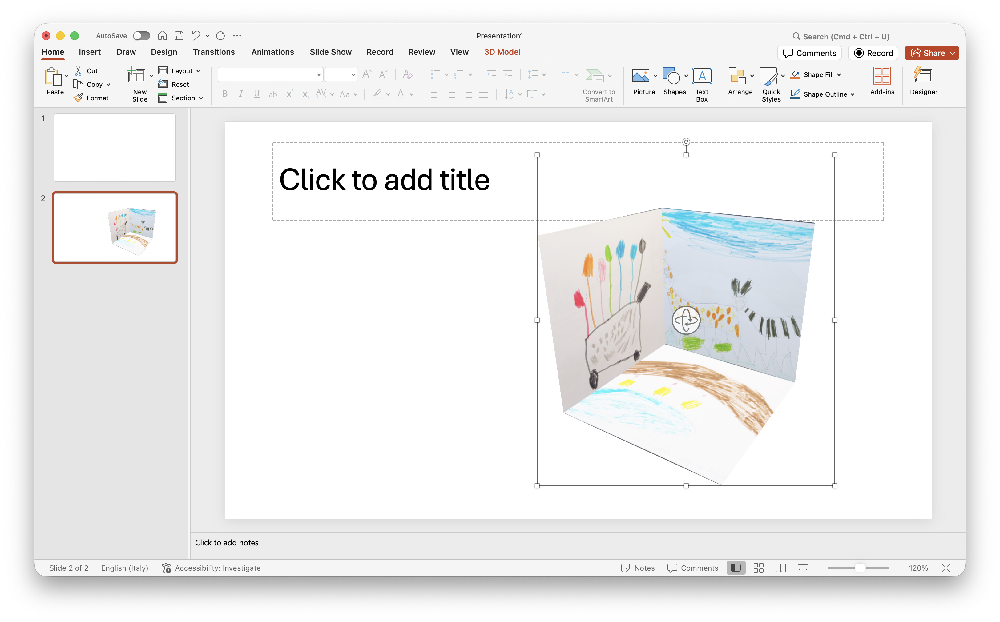

# sXRetch (apps/sxretch)

Static web app that turns 2D sketches, drawings, and images into downloadable AR/XR files (USDZ for iOS/iPadOS, GLB for Android), with an in-page preview.

sXRetch is built to speed up immersive prototyping: take something you drew, place it in space, and move quickly into SDK workflows like Xcode or Android Studio.

## The story

One Saturday afternoon, Francesco’s daughter Celeste (five years old) watched Mary Poppins step inside a drawing and asked: “Papà, can we do that with the computer?”

By the end of that afternoon, they could: Celeste’s drawing was floating in their living room on an iPhone.

What started as a family experiment became a simple tool that converts any image into an XR-ready 3D file in seconds, entirely in the browser, with no installation and no upload.

## Local run

This folder is a fully self-contained static site. To make translation loading work (`translations.json`), you must run it from a local web server (not `file://`).

Example:

```bash
cd /path/apps/sxretch
python3 -m http.server 8000
```

Then open `http://localhost:8000/`.

## Preview




[Demo video (MP4)](assets/video_sxretch_demo.mp4)

[USDZ prototype demo (MP4)](assets/video_sxretch_usdz.mp4)

## Structure

- `index.html`: UI + JS logic (vanilla) + embedded EN translations (fallback).
- `translations.json`: multi-language dictionary (all languages except `en`).
- `sxretch.css`: stylesheet.
- `assets/`: demo images, icons, and example files (USDZ/GLB).
- `assets/video_sxretch_demo.mp4`: hero demo video used in the header.
- `assets/video_sxretch_usdz.mp4`: demo video used in the audience section (Spatial UI prototyping).
- `tools/i18n_audit.py`: utility to verify i18n key parity against the embedded EN keys.

## i18n (localization)

- `en` is embedded in `index.html` as a robust fallback.
- Other languages are loaded via `fetch('translations.json')`.
- If `translations.json` is unavailable, the app keeps working (English fallback).

## Privacy & data

- 100% client-side generation: no images, data, or generated USDZ/GLB files are uploaded to a server by sXRetch.
- Third-party resources loaded at runtime may log your IP address per their own privacy policies (e.g. CDN/font hosting).
- Runtime resources include:
  - Fonts: IBM Plex Sans + Noto Sans (RTL/CJK) via Google Fonts
  - Preview/AR activation: `@google/model-viewer` via unpkg.com
  - GLB texture compression (optional): KTX2 encoder via esm.sh / unpkg.com (only when generating GLB and the encoder is available)

## Known issues

- Main contains known bugs due to the development sprint.
- Translation note: some language strings were drafted with AI and may contain inaccuracies.

## Runtime dependencies

- `@google/model-viewer` from CDN (unpkg) is used only for preview and AR/WebXR activation; it does not affect exported files.
- Fonts from Google Fonts (IBM Plex Sans + Noto Sans for RTL/CJK scripts).

## Legal notes & credits

- The project includes a header with license: CC BY-NC-ND 4.0.
- The in-app footer contains credits and attributions (Apple USDZ, Google Model-Viewer, Disney Mary Poppins, etc.).

## Quick maintenance

- To add/update a language: edit `translations.json`.
- To change styling: edit `sxretch.css`.
- To update demo assets: replace files in `assets/`, keeping the same filenames if they are referenced in the page.
- To audit i18n keys: run `python3 tools/i18n_audit.py` from `apps/sxretch/`.

## Notes

- Total supported languages: 31 (30 in `translations.json` + `en` embedded in `index.html`).
- Recent CSS tweaks: removed default bottom spacing on `img`/`video`, reduced app `body` bottom padding, added `4px` padding on `.workflow-container`.
- sXRetch v1.0 · Last updated: 29 Mar 2026 · Agentic coding with a “vibe” twist — built in TRAE.
